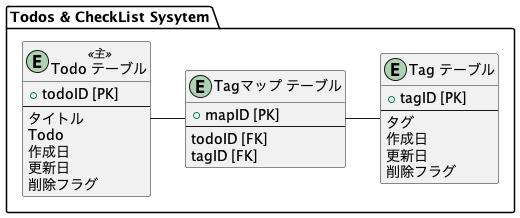
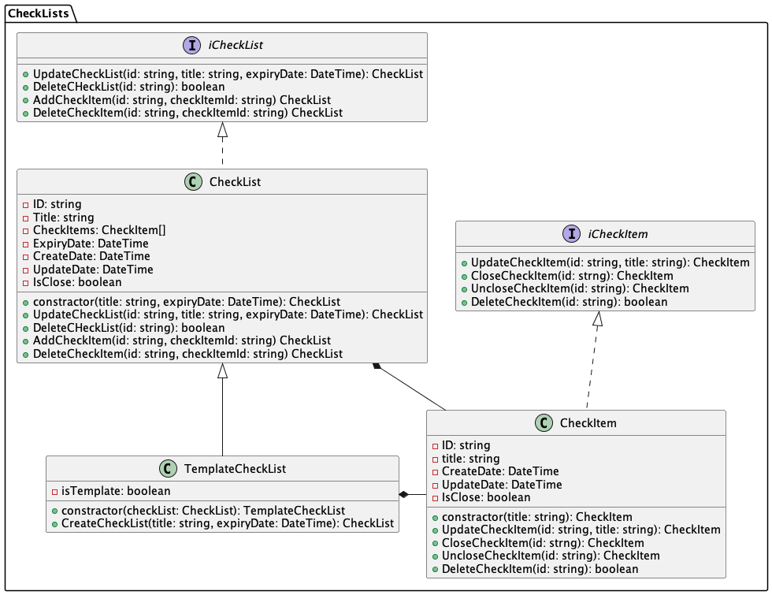
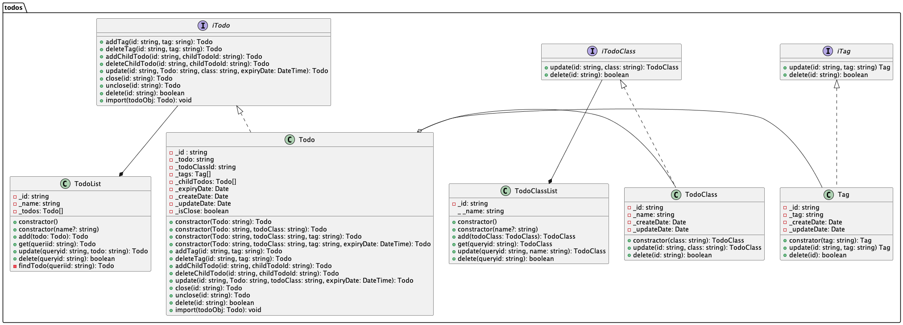

# TodoCheckList アプリ

自分用に Todo + CHeckList アプリがあるといいなと言う事でを作る事にした。
独学用に NestJS(nodeJs + Typescript) + DB(MySQL + Rdis) & Flutter で作ってみる。

## システム構成

### 開発環境

Mac にて。エディタは VSCode。

### サーバーサイド

NestJS が面白そうなので採用。Zenn に NestJS 関する情報が集まっているので参考に。

参考：[NestJSの本一覧](https://zenn.dev/topics/nestjs?tab=books)

### クライアントサイド

採用試験で落選した時に、Flutterを知った。面白そうなのでクライアントはFlutterで。情報収集はこれから。

## サーバーサイド

### 環境構築

サーバーは Docker (VSCode Devcontainer)を使う。

- プロジェクト作成: `nest new --skip-git server` パッケージマネージャーは npm を選択

```log
node ➜ /workspace $ nest new --skip-git server
⚡  We will scaffold your app in a few seconds..

? Which package manager would you ❤️  to use? npm
CREATE server/.eslintrc.js (663 bytes)
CREATE server/.prettierrc (51 bytes)
CREATE server/README.md (3340 bytes)
CREATE server/nest-cli.json (171 bytes)
CREATE server/package.json (1945 bytes)
CREATE server/tsconfig.build.json (97 bytes)
CREATE server/tsconfig.json (546 bytes)
CREATE server/src/app.controller.ts (274 bytes)
CREATE server/src/app.module.ts (249 bytes)
CREATE server/src/app.service.ts (142 bytes)
CREATE server/src/main.ts (208 bytes)
CREATE server/src/app.controller.spec.ts (617 bytes)
CREATE server/test/jest-e2e.json (183 bytes)
CREATE server/test/app.e2e-spec.ts (630 bytes)

✔ Installation in progress... ☕

🚀  Successfully created project server
👉  Get started with the following commands:

$ cd server
$ npm run start

                                         
                          Thanks for installing Nest 🙏
                 Please consider donating to our open collective
                        to help us maintain this package.
                                         
                                         
               🍷  Donate: https://opencollective.com/nest
                                         
node ➜ /workspace $ cd server
node ➜ /workspace/server $ npm run start

> server@0.0.1 start
> nest start

[Nest] 2540  - 08/04/2024, 10:26:26 AM     LOG [NestFactory] Starting Nest application...
[Nest] 2540  - 08/04/2024, 10:26:26 AM     LOG [InstanceLoader] AppModule dependencies initialized +45ms
[Nest] 2540  - 08/04/2024, 10:26:26 AM     LOG [RoutesResolver] AppController {/}: +34ms
[Nest] 2540  - 08/04/2024, 10:26:26 AM     LOG [RouterExplorer] Mapped {/, GET} route +12ms
[Nest] 2540  - 08/04/2024, 10:26:26 AM     LOG [NestApplication] Nest application successfully started +9ms
^C
node ➜ /workspace/server $ 
```

- サーバー起動確認: ブラウザで `http://localhost:3000` を開いて Hello World! を表示すればOK.


- フォルダ構成: 初心者なので、書籍の構成をそのまま使わせていただきます。名称がちょっと気になったので `models/` フォルダは `entities/` に変更、マイグレーション用フォルダ `migrations/` を追加。

参考：[簡易TODOウェブアプリの開発-Next.js×NestJS(REST・TypeORM)](https://zenn.dev/engineerhikaru/books/0a615c1248a2ea) 

```
./
├── dist/
├── migrations/
├── node_modules/
├── src/
│   ├── config/
│   ├── constants/
│   ├── controllers/
│   ├── dto/
│   ├── entities/
│   ├── models/
│   ├── services/
│   ├── app.controller.spec.ts
│   ├── app.controller.ts
│   ├── app.module.ts
│   ├── app.service.ts
│   └── main.ts
├── test/
│   ├── app.e2e-spec.ts
│   └── jest-e2e.json
├── .eslintrc.js
├── .prettierrc
├── nest-cli.json
├── package.json
├── package-lock.json
├── README.md
├── tsconfig.build.json
└── tsconfig.json
```

- セットアップ: こちらも、書籍のセットアップをそのまま使用。

参考：「[簡易TODOウェブアプリの開発-Next.js×NestJS(REST・TypeORM)](https://zenn.dev/engineerhikaru/books/0a615c1248a2ea) 」

  - コード整形(ESLint,Prettier)の設定
    - ~~`.eslintrc.js` を `.eslintrc.json` に変更: 今後 `.eslintrc.js` は廃止されていくようなのですが、移行先は `.eslint.config.js` らしいのですが、その件は後で。「[ESLint を eslintrc から Flat Config に移行する、ハマりポイントを添えて。](https://qiita.com/Shilaca/items/c494e4dc6b536a5231de)」~~
    - `.eslintrc.js` を `eslint.config.mjs` に変更：　今回構築した環境では設定ファイルが新版に変わっていた。コマンド `npm create @eslint/config` で作成。実行は `eslint ソースファイル名` でOK
    - `.prettierrc` を `.prettierrc.json` に変更: `rc` ファイルより `json` を優先するらしい。「[Prettier Configuration File](https://prettier.io/docs/en/configuration.html)」
    - `workspace` 直下に `.vscode` フォルダを作成し、その直下に`settings.json` を作成: VSCode用設定ファイル

`npm create @eslint/config` を実行
```log
node ➜ /workspace/server $  npm create @eslint/config

> server@0.0.1 npx
> create-config

@eslint/create-config: v1.2.0

✔ How would you like to use ESLint? · syntax
✔ What type of modules does your project use? · esm
✔ Which framework does your project use? · none
✔ Does your project use TypeScript? · typescript
✔ Where does your code run? · browser
The config that you've selected requires the following dependencies:

eslint@9.x, globals, typescript-eslint
✔ Would you like to install them now? · No / Yes
✔ Which package manager do you want to use? · npm
☕️Installing...

...

found 0 vulnerabilities
A config file was generated, but the config file itself may not follow your linting rules.
Note that some plugins currently do not support ESLint v9 yet.
You may need to use '--force' when installing, or add the following to your package.json: 
"overrides": { "eslint": "^9.8.0" } 
node ➜ /workspace/server $ 
```

メッセージにあるように `package.json` に `"overrides": { "eslint": "^9.8.0" } ` を追加

eslint.config.mjs
~~~javascript
import globals from "globals";
import tseslint from "typescript-eslint";


export default [
  {files: ["**/*.{js,mjs,cjs,ts}"]},
  {languageOptions: { globals: globals.browser }},
  ...tseslint.configs.recommended,
];
~~~

.prettierrc.json
~~~json
{
  "printWidth": 120,
  "trailingComma": "all",
  "tabWidth": 2,
  "semi": false,
  "singleQuote": true,
  "jsxSingleQuote": true,
  "endOfLine": "lf",
  "parser": "typescript"
}
~~~

.vscode/settings.json
~~~json
{
  "editor.formatOnSave": true,
  "editor.defaultFormatter": "esbenp.prettier-vscode",
  "editor.codeActionsOnSave": {
    "source.fixAll.eslint": true
  }
}
~~~

- インポートのエイリアス化: ファイルをインポートする時の可読性をよくするためにインポートのエイリアス化をする

tsconfig.json
~~~json
- "noFallthroughCasesInSwitch": false
+ "noFallthroughCasesInSwitch": false,
+ "paths": {
+   "@/*": ["./src/*"]
+ }
}
~~~

### データベース構築

データベースは MySQL を利用。最初最新バージョン(9.0)を利用しようとしたが、どうしても TypeORM でログインできなかった。今回は MySQL のバージョンを 8.0 に変更した。おそらく `mysql_native_password` を利用できなかった事が原因だと思われる。

参考：[MySQL8.4での mysql_native_password 認証プラグインの扱い](https://blog.s-style.co.jp/2024/05/11793/)

- ログイン: ターミナルから別コンテナの MySQL にログイン

~~~log
node ➜ /workspace $ mysql -u root -p -h mysql
Enter password: 
Welcome to the MariaDB monitor.  Commands end with ; or \g.
Your MySQL connection id is 9
Server version: 8.0.39 MySQL Community Server - GPL

Copyright (c) 2000, 2018, Oracle, MariaDB Corporation Ab and others.

Type 'help;' or '\h' for help. Type '\c' to clear the current input statement.

MySQL [(none)]> 
~~~

- データベース作成: 

~~~log
MySQL [(none)]> CREATE DATABASE tododb;
Query OK, 1 row affected (0.017 sec)

MySQL [(none)]> show databases;
+--------------------+
| Database           |
+--------------------+
| information_schema |
| mysql              |
| performance_schema |
| sys                |
| tododb             |
+--------------------+
5 rows in set (0.002 sec)

MySQL [(none)]> 
~~~

- ユーザー作成と権限付与: 

~~~log
MySQL [(none)]> CREATE USER todouser IDENTIFIED BY 'passowrd';
Query OK, 0 rows affected (0.028 sec)

MySQL [(none)]> GRANT ALL ON *.* TO 'todouser'@'%';
Query OK, 0 rows affected (0.013 sec)

MySQL [(none)]> ALTER USER todouser IDENTIFIED WITH mysql_native_password by 'password';
Query OK, 0 rows affected (0.009 sec)

MySQL [(none)]> 
~~~

- TypeORMモジュールインストール: `npm i @nestjs/typeorm typeorm mysql2`

- TypeOrm MySQL 接続確認: `app.module.ts` を修正後、`npm run start` を実行しエラーが出力されずに起動することを確認する

`app.module.ts`
```typescript
import { Module } from '@nestjs/common';
import { TypeOrmModule } from '@nestjs/typeorm';

@Module({
  imports: [
    TypeOrmModule.forRoot({
      type: 'mysql',
      host: 'mysql',
      port: 3306,
      database: 'tododb',
      username: 'todouser',
      password: 'password',
      entities: [__dirname + '/**/*.model{.ts,.js}'],
      migrations: [__dirname + '/migration/**/*.js'],
      synchronize: true,
      logging: true,
    }),
  ],
  controllers: [],
  providers: [],
})

export class AppModule {}
```

```log
node ➜ /workspace/server $ npm run start

> server@0.0.1 start
> nest start

[Nest] 34939  - 08/05/2024, 3:07:07 AM     LOG [NestFactory] Starting Nest application...
[Nest] 34939  - 08/05/2024, 3:07:07 AM     LOG [InstanceLoader] AppModule dependencies initialized +347ms
[Nest] 34939  - 08/05/2024, 3:07:07 AM     LOG [InstanceLoader] TypeOrmModule dependencies initialized +0ms
query: SELECT VERSION() AS `version`
query: START TRANSACTION
query: SELECT * FROM `INFORMATION_SCHEMA`.`COLUMNS` WHERE `TABLE_SCHEMA` = 'tododb' AND `TABLE_NAME` = 'typeorm_metadata'
query: COMMIT
[Nest] 34939  - 08/05/2024, 3:07:07 AM     LOG [InstanceLoader] TypeOrmCoreModule dependencies initialized +184ms
[Nest] 34939  - 08/05/2024, 3:07:07 AM     LOG [NestApplication] Nest application successfully started +19ms
^C
node ➜ /workspace/server $ 
```

### TypeORM によるデータベースマイグレーション

データベースマイグレーションとは「DB の変更内容をファイルに記録し、その内容を実行して DB のスキーマを更新していく手法」のこと。

参照：[【初心者向け🔰】DB の「スキーマ」「ORM」「マイグレーション」とは何か](https://qiita.com/to3izo/items/7b8d44021cb386de2ef7)　より

マイグレーションを利用しない場合、データベースの構成とプログラムの構成のアンマッチが発生する可能性があります。また、マイグレーションがあればテーブルを操作するSQLを作ってくれるので助かります。僕はできるだけ使いたいと思っている。NestJSはTypeORMを含んでいるので今回はTypeORMを使います。

Todo用テーブルから作成してみる。作成するテーブルはこんな感じ。このテーブルをマイグレーションしていく。



今回インストールした TypeORM のバージョンは 0.3.20。どうやらバージョン 0.3系は色々変更があったようで慌てました。

参考：[TypeORM 0.3系のマイグレーション](https://qiita.com/Aurum64/items/f5962bd2a643447dbef9)

- エンティティ（テーブル定義）ファイル作成: `src/entities/` に書くテーブルのエンティティ定義を作成する。 `todos`, `tags`, `tagMaps` を作成した。

参考：[TypeORMを使用して、TypeScriptでMySQLのマイグレーション、接続を管理する](https://qiita.com/hedrall/items/4297ae0a92ce577b835f)

- データソースファイル作成: `src/config/ormconfig.ts` 

```typescript
import "reflect-metadata";
import { DataSource } from "typeorm";

export const AppDataSource = new DataSource({
    type: 'mysql',
    host: 'mysql',
    port: 3306,
    database: 'tododb',
    username: 'todouser',
    password: 'Todos%8832',
    entities: ['src/entities/*.model{.ts,.js}'],
    migrations: ['migrations/*.ts'],
    synchronize: true,
    logging: true,
    subscribers: [],
});
```

- スクリプト登録: `package.json`に実行スクリプトを登録

```json
    "typeorm": "npx typeorm-ts-node-commonjs",
    "migration:create": "npx typeorm migration:create migrations/${npm_config_name}",
    "migration:generate": "npx typeorm-ts-node-commonjs migration:generate migrations/${npm_config_name} -d src/config/ormconfig.ts",
    "migration:run": "npx typeorm-ts-node-commonjs migration:run -d src/config/ormconfig.ts"
```

- スクリプト実行: 
    - `create`: 空のマイグレーションファイル作成
    - `generate`: entityからのマイグレーションファイル作成
    - `run`: マイグレーション実行

```log
node ➜ /workspace/server $ npm run migration:create --name=TodoMigration

> server@0.0.1 migration:create
> npx typeorm migration:create migrations/${npm_config_name}

Migration /workspace/server/migrations/1722839821400-TodoMigration.ts has been generated successfully.
node ➜ /workspace/server $ npm run migration:generate --name=TodoMigration

> server@0.0.1 migration:generate
> npx typeorm-ts-node-commonjs migration:generate migrations/${npm_config_name} -d src/config/ormconfig.ts

query: SELECT VERSION() AS `version`
query: SELECT DATABASE() AS `db_name`
query: SELECT `TABLE_SCHEMA`, `TABLE_NAME`, `TABLE_COMMENT` FROM `INFORMATION_SCHEMA`.`TABLES` WHERE `TABLE_SCHEMA` = 'tododb' AND `TABLE_NAME` = 'todos' UNION SELECT `TABLE_SCHEMA`, `TABLE_NAME`, `TABLE_COMMENT` FROM `INFORMATION_SCHEMA`.`TABLES` WHERE `TABLE_SCHEMA` = 'tododb' AND `TABLE_NAME` = 'tag_maps' UNION SELECT `TABLE_SCHEMA`, `TABLE_NAME`, `TABLE_COMMENT` FROM `INFORMATION_SCHEMA`.`TABLES` WHERE `TABLE_SCHEMA` = 'tododb' AND `TABLE_NAME` = 'tags'
query: SELECT * FROM `INFORMATION_SCHEMA`.`COLUMNS` WHERE `TABLE_SCHEMA` = 'tododb' AND `TABLE_NAME` = 'typeorm_metadata'
Migration /workspace/server/migrations/1722839828657-TodoMigration.ts has been generated successfully.
node ➜ /workspace/server $ npm run migration:run --name=TodoMigration

> server@0.0.1 migration:run
> npx typeorm-ts-node-commonjs migration:run -d src/config/ormconfig.ts

query: SELECT VERSION() AS `version`
query: SELECT * FROM `INFORMATION_SCHEMA`.`COLUMNS` WHERE `TABLE_SCHEMA` = 'tododb' AND `TABLE_NAME` = 'migrations'
query: CREATE TABLE `migrations` (`id` int NOT NULL AUTO_INCREMENT, `timestamp` bigint NOT NULL, `name` varchar(255) NOT NULL, PRIMARY KEY (`id`)) ENGINE=InnoDB
query: SELECT * FROM `tododb`.`migrations` `migrations` ORDER BY `id` DESC
0 migrations are already loaded in the database.
2 migrations were found in the source code.
2 migrations are new migrations must be executed.
query: START TRANSACTION
query: INSERT INTO `tododb`.`migrations`(`timestamp`, `name`) VALUES (?, ?) -- PARAMETERS: [1722839821400,"TodoMigration1722839821400"]
Migration TodoMigration1722839821400 has been  executed successfully.
query: CREATE TABLE `todos` (`id` varchar(255) NOT NULL, `title` varchar(255) NOT NULL, `todo` varchar(255) NOT NULL, `createDate` datetime(6) NOT NULL DEFAULT CURRENT_TIMESTAMP(6), `closeDate` datetime(6) NOT NULL DEFAULT CURRENT_TIMESTAMP(6), `isClose` tinyint NOT NULL, PRIMARY KEY (`id`)) ENGINE=InnoDB
query: CREATE TABLE `tag_maps` (`id` varchar(255) NOT NULL, `todoId` varchar(255) NOT NULL, `tagId` varchar(255) NOT NULL, PRIMARY KEY (`id`)) ENGINE=InnoDB
query: CREATE TABLE `tags` (`id` varchar(255) NOT NULL, `tag` varchar(255) NOT NULL, `createDate` datetime(6) NOT NULL DEFAULT CURRENT_TIMESTAMP(6), `deleteDate` datetime(6) NOT NULL DEFAULT CURRENT_TIMESTAMP(6), `isDelete` tinyint NOT NULL, PRIMARY KEY (`id`)) ENGINE=InnoDB
query: INSERT INTO `tododb`.`migrations`(`timestamp`, `name`) VALUES (?, ?) -- PARAMETERS: [1722839828657,"TodoMigration1722839828657"]
Migration TodoMigration1722839828657 has been  executed successfully.
query: COMMIT
node ➜ /workspace/server $ 
```

- データベース確認: MySQL に作成されたテーブルを確認

```log
MySQL [(none)]> connect tododb;
Reading table information for completion of table and column names
You can turn off this feature to get a quicker startup with -A

Connection id:    29
Current database: tododb

MySQL [tododb]> show tables;
+------------------+
| Tables_in_tododb |
+------------------+
| migrations       |
| tag_maps         |
| tags             |
| todos            |
+------------------+
4 rows in set (0.002 sec)

MySQL [tododb]> DESCRIBE todos;
+------------+--------------+------+-----+----------------------+-------------------+
| Field      | Type         | Null | Key | Default              | Extra             |
+------------+--------------+------+-----+----------------------+-------------------+
| id         | varchar(255) | NO   | PRI | NULL                 |                   |
| title      | varchar(255) | NO   |     | NULL                 |                   |
| todo       | varchar(255) | NO   |     | NULL                 |                   |
| createDate | datetime(6)  | NO   |     | CURRENT_TIMESTAMP(6) | DEFAULT_GENERATED |
| closeDate  | datetime(6)  | NO   |     | CURRENT_TIMESTAMP(6) | DEFAULT_GENERATED |
| isClose    | tinyint      | NO   |     | NULL                 |                   |
+------------+--------------+------+-----+----------------------+-------------------+
6 rows in set (0.003 sec)

MySQL [tododb]> DESCRIBE tabs;
ERROR 1146 (42S02): Table 'tododb.tabs' doesn't exist
MySQL [tododb]> DESCRIBE tags;
+------------+--------------+------+-----+----------------------+-------------------+
| Field      | Type         | Null | Key | Default              | Extra             |
+------------+--------------+------+-----+----------------------+-------------------+
| id         | varchar(255) | NO   | PRI | NULL                 |                   |
| tag        | varchar(255) | NO   |     | NULL                 |                   |
| createDate | datetime(6)  | NO   |     | CURRENT_TIMESTAMP(6) | DEFAULT_GENERATED |
| deleteDate | datetime(6)  | NO   |     | CURRENT_TIMESTAMP(6) | DEFAULT_GENERATED |
| isDelete   | tinyint      | NO   |     | NULL                 |                   |
+------------+--------------+------+-----+----------------------+-------------------+
5 rows in set (0.004 sec)

MySQL [tododb]> DESCRIBE tag_maps;
+--------+--------------+------+-----+---------+-------+
| Field  | Type         | Null | Key | Default | Extra |
+--------+--------------+------+-----+---------+-------+
| id     | varchar(255) | NO   | PRI | NULL    |       |
| todoId | varchar(255) | NO   |     | NULL    |       |
| tagId  | varchar(255) | NO   |     | NULL    |       |
+--------+--------------+------+-----+---------+-------+
3 rows in set (0.002 sec)

MySQL [tododb]> 
```

### Model: クエリ

必要なクエリを設計。NestJS(TypeORM)ではRepositoryを使ってデータを操作するらしい。つまり、このクエリを Repository に変換が必要だ。

- データ作成

```sql
insert into todos values('aaaa1111', 'todo1', 'todo1 read books', NOW(), CAST('1900-01-01' as date), 0);
insert into todos values('aaaa1112', 'todo2', 'todo2 ride bike', NOW(), CAST('1900-01-01' as date), 0);
insert into todos values('aaaa1113', 'todo3', 'todo3 create program', NOW(), CAST('1900-01-01' as date), 0);

insert into tags values('bbbb1111', 'private', NOW(), CAST('1900-01-01' as date), 0);
insert into tags values('bbbb1112', 'work', NOW(), CAST('1900-01-01' as date), 0);

insert into tag_maps values('cccc1111', 'aaaa1111', 'bbbb1111');
insert into tag_maps values('cccc1113', 'aaaa1113', 'bbbb1112');
```

- todo一覧

```sql
select t.*, ifnull(g.tag, '') as tag from todos as t left outer join tag_maps as m on t.id = m.todoid left outer join tags as g on m.tagId = g.id;
```

- todo削除

```sql
delete from todos where id = '*******';
```

- todo更新

```sql
update todos set title = '******', todo = '*******' where id = '********';
```

- todo抽出

```sql
select t.*, ifnull(g.tag, '') as tag from todos as t left outer join tag_maps as m on t.id = m.todoid left outer join tags as g on m.tagId = g.id where t.id = '******';
```

- tag一覧

```sql
select * from tags;
```

- tag削除

```sql
delete from tags where id = '*******';
```

- tag更新

```sql
update tags set tag = '******' where id = '*********';
```

- tag_maps削除

```sql
delete tag_maps where id = '********';
```

---

ここから開発工程に入ることになる。Typescript + TDD で開発したいのだがやった事がないのでよくわからない。と言うわけで、 Typescript + TDD の修行を先にする事にする。現在の環境で覚えたいので `workspace/` に別のプロジェクトを作ってやってみることにする。

[Typescript + TDD 入門](./workspace/tdd-typescript/Readme.md)

---

### システム設計を考える

自分の作りたい　Todos & CheckList をもう一度考えてみる。作りたい機能を慣れべてみる。

- Todo
  - Todoを登録、変更、削除する
  - データ項目
    - todo
    - 期限
    - 作成日
    - 更新日
    - 終了フラグ 
  - Todoは分類分けできる（GTD風）
    - 標準分類：Inbox/一時保管箱/受信トレイ/
  - Todoは細分化できる
    - 親-子関係を作る？
  - Todoにはタグをつける事ができる
  - タグは一つのTodoに複数つける事ができる
  - Todoは完了する
  - 完了したTodoを未完了にできる
  - 並べ替えができる
    - 作成順
    - タイトル順
    - タグ順
  - 完了していない Todo で絞り込み
- CheckList
  - 一時的CheckListを作成できる
  - 項目の作成、変更、削除できる
  - データ項目
    - チェックリストタイトル
    - チェックリスト期限
    - チェックリスト作成日
    - チェックリスト更新日
    - チェックリスト完了フラグ
    - チェック項目タイトル
    - チェックリスト完了フラグ
  - チェックリストにタイトル、目的、期限をもつ
  - テェック項目は完了する
  - CheckListはテンプレートを持つ
    - テンプレートをコピー
    - タイトルを付けて保存
  - CheckListは期間単位を持つ
    - 今日
    - 今週
    - 今月
    - 何日まで
  - 完了していない CheckList で絞り込み

仮に作ったテーブルと項目が違う事がよくわかるが、データベースのマイグレーションは後回し。保存しない Todos & CheckList を作ることにする。

ここで、ザクっとクラス図を作る。




### Model: Todo

とりあえず実装を開始。TDDでTodoクラスを実装してみた。途中でコレクションクラスとTodoクラスとTodoClassクラスを管理するクラスも欲しくなった。それと実装開始する前にTypescriptの命名規則、コーディング基準を調べてみた。するとクラス名はPascalCase、変数やメソッド名はCamelCaseで記述するのだ（そうかマイクロソフトだからC#と同じと言う訳だ）。と言うわけでクラス図を変更する。

クラス図のレイアウトが酷いのだが、後で直すことにする。



### TsDoc

プログラムソースにコメントを追記しようと思ったところでJavaのJavaDocのようなものがTypescriptにも無いのか調べてみると**TsDoc**と言うものがあるらしい。がしかし、Javaがなくては実行できない。コンポーネントにJavaをインストールする。

参考：[TSDoc](https://zenn.dev/c_hero/scraps/8df7279932ae40)

コメントは後で追記するのは面倒なので、ここでコメントを追記することにした。TsDocを必須化する方法もあったので試してみる。~~がしかし、全くうまくいかない。~~
フラットconfigで設定を見直してうまくいった。

```javascript
import jsdoc from "eslint-plugin-jsdoc";

export default [
  ...
  // configuration included in plugin
  jsdoc.configs['flat/recommended-typescript-error'],
  // other configuration objects...
  {
    plugins: {
      jsdoc: jsdoc
    },
    rules: {
      'jsdoc/require-throws': 'warn'
    }
  },
  ....
];
```

参考：[ESLint を使って JSDoc / TSDoc の記述を必須化する](https://zenn.dev/wakamsha/articles/setup-eslint-plugin-jsdoc)
参考：[eslint-plugin-jsdoc](https://www.npmjs.com/package/eslint-plugin-jsdoc)

以下のコマンドでtypescriptファイルを読み込んでHTMLドキュメントを作成する。

```command
npx typedoc --out ./docs ./src/modules/Todo.ts
```

しかし、現在のブラウザは file:// でHTMLドキュメントを開く事ができない。生成ドキュメントをMarkdownにする方法を調べてみた。`typedon`と`typedoc-plugin-markdown`をインストールするだけでOK。

```command
npm install --save-dev typedoc typedoc-plugin-markdown
```

実行はこんな感じ。面倒なのでpackage.jsonにスクリプトを追加。

```command
npx typedoc --plugin typedoc-plugin-markdown "src/index.ts"
```

```JSON
{
  "scripts": {
    "tsdoc": "npx typedoc --plugin typedoc-plugin-markdown --readme none"
  }
}
```

参考：[TypeScriptのJSDocからMarkdownでドキュメントを自動生成](https://qiita.com/Robot-Inventor/items/45e4733aa3f87e9b0b41)